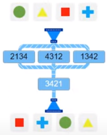
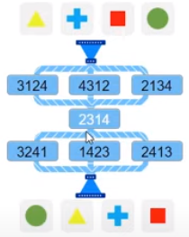

# Ace the switch and numeracy online tests!
If you have received an invitation to participate in online tests during the hiring process, this program will help you pass two types of test easily: digitChallenge (Numeracy) and switchChallenge (Logical Reasoning).

## digitChallenge (Numeracy)

In this test you are presented with a simple formulas:
```
_ * _ = number
_ + _ + _ = number
_ - _ + _ = number
_ - _ - _ = number
_ + _ + _ + _ = number
_ + _ - _ + _ = number
_ + _ - _ - _ = number
_ * _ + _ = number
_ * _ - _ = number
_ * _ + _ + _ = number
_ * _ - _ + _ = number
_ * _ - _ - _ = number
_ * _ * _ = number
_ * _ * _ + _ = number
_ * _ * _ - _ = number
```
Your task is to find missing numbers, for example:
```
 _ * _ = 20, 
 answer -> 4 * 5 = 20
 Pretty easy
 
 And what about this example:
 _ * _ * _ - _ = 502
 
 This one is really hard to solve in time pressure environment,
 answer ->  9 * 8 * 7 - 2 = 502
```
### Acing numeracy test
1. Open digitChallenge test and start a python script `numeracy_test.py` on one monitor beside each other.
2. Start a test
3. If a question is very simple: 3 unknowns or fewer in the formula and known number <= 10, solve it by yourself, it's faster.
4. If the question is harder, then enter the known number in python script, it will produce solutions for all formulas if the solution exists.
5. Find the target formula in solutions and enter digits from the solution in the test.

Examples:
```
Number: 104

9 * 6 * 2 - 4 = 104

Number: 92

7 * 6 * 2 + 8 = 92
8 * 6 * 2 - 4 = 92

Number: 15

5 * 3 = 15

1 + 5 + 9 = 15
7 - 1 + 9 = 15

1 + 2 + 3 + 9 = 15
1 + 7 - 2 + 9 = 15

6 * 1 + 9 = 15
8 * 2 - 1 = 15

2 * 1 + 4 + 9 = 15
8 * 1 - 2 + 9 = 15
6 * 3 - 1 - 2 = 15

1 * 3 * 5 = 15
3 * 2 * 1 + 9 = 15
9 * 2 * 1 - 3 = 15

Number: 139

9 * 5 * 3 + 4 = 139
9 * 8 * 2 - 5 = 139 
```
## switchChallenge (Logical Reasoning)
This type of challenge is very tricky and very hard to master, you have to spend a lot of hours before you can pass it by yourself.
Typical example:



The solution is 2134, but it's very hard to process those kinds of tasks in a time-pressure environment.

### Acing switch test
1. Open switchChallenge test and start a python script `switch_test.py` on one monitor beside each other.
2. Start a test
3. If a question is very simple: 1 transformation, solve it by yourself, it's faster.
4. If the question is harder, then input the puzzle row by row into the script and execute (input instructions belows) 

### Enter the puzzle to the program
To solve the puzzle, you need to break it down into rows and input each row in the same order to the script.
Each row consists of a list of transformers, the transformer is a 4-digit representation of the transformation operation.

The program awaits four rows of data. Data can be:
1. None - no input
2. 1234 - one transformer
3. 1234 2314 4123 - a list of transformers. The list can be infinite
4. 0 - unknown transformer, which should be found.

Let's check the example:


```
row: 0

row: 3421

row: 3412

row: 
['0', '3421', '3412', '']

solution
  2134
▓ 3421

row: 
```
Explanation: 
1. The starting row holds images, which are always equal to the transformer 1234, we don't need to input it, skipping.
2. The first puzzle row contains the list of transformers, one of which is the solution. So, we entered 0 for that row
3. The second puzzle row consists of one transformer 2134, we entered 2134
4. The third puzzle row is the result below the switch: square, plus, circle, triangle. Comparing these object with the starting images gives us the 3412

The resulting input is ['0', '3421', '3412', '']

The solution consists of rows with valid transformers, in the example above it's 2134

<b>Let's solve the same example in a different way</b>:
```
row: 2134 4312 1342

row: 3421

row: 3412

row: 
['2134 4312 1342', '3421', '3412', '']

solution
▓░░ 2134
 ▓  3421

row: 
```
This time we've entered a whole puzzle and received a more accurate result, showing the location of the transformer in the row of transformers.
It's more clear, but requires input from all transformers and requires more time for input.

<b>Complex example</b>

This example is the most complex task you will encounter and requires up to 60 seconds to solve it by yourself.


We omit the input of the first row with 0, so the program found 3 solution to choose from
```
row: 0

row: 2314

row: 3241 1423 2413

row: 4123
['0', '2314', '3241 1423 2413', '4123']

solution
    3241
 ▓  2314
░░▓ 2413

solution
    3421
 ▓  2314
░▓░ 1423

solution
    4312
 ▓  2314
▓░░ 3241
```

Entering all rows produces this beautiful result. Personally, I prefer to input all rows for such complex puzzles.
```
row: 3124 4312 2134

row: 2314

row: 3241 1423 2413

row: 4123
['3124 4312 2134', '2314', '3241 1423 2413', '4123']

solution
░▓░ 4312
 ▓  2314
▓░░ 3241
```
 
#### Final thoughts
I hope it'll help you pass the test. 
<br>Scripts were tested on python 3.7
<br>The code is a bit ugly, it was created in a very short timeframe, without a purpose of developing it further. 
